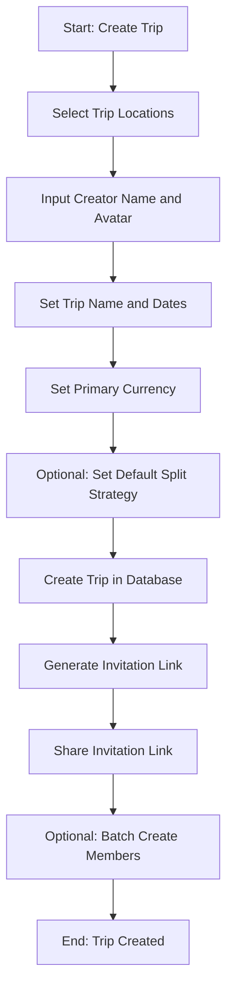

# Create a Trip Workflow Documentation

## Table of Contents

1. [Overview](#overview)
2. [Workflow Steps](#workflow-steps)
   - [Step 1: Select Trip Locations](#step-1-select-trip-locations)
   - [Step 2: Input Creator Information and Avatar](#step-2-input-creator-information-and-avatar)
   - [Step 3: Set Trip Details and Preferences](#step-3-set-trip-details-and-preferences)
   - [Step 4: Invite Members](#step-4-invite-members)
3. [Implementation Considerations](#implementation-considerations)
   - [User Experience](#user-experience)
   - [Data Integrity](#data-integrity)
   - [Scalability](#scalability)
4. [System Design](#system-design)
   - [Entities](#entities)
   - [Data Flow](#data-flow)
   - [Location Services](#location-services)
5. [Flowchart](#flowchart)

---

## Overview

The **Create a Trip** workflow in Waritally enables a user (the creator) to start a new trip by selecting locations, providing their own details, setting trip preferences, and inviting members. This process is designed to be intuitive and engaging, ensuring that all essential trip information is collected efficiently while enhancing the user experience with personalized features.

### Goals

- Simplify trip creation for the user.
- Gather critical trip details, such as locations and member information.
- Offer an enjoyable experience with features like location-specific avatars.
- Maintain data accuracy and consistency throughout the process.

---

## Workflow Steps

### Step 1: Select Trip Locations

**Goal**: Enable the creator to pick one or more destinations for the trip.

**Description**:

- The creator is presented with an interface featuring a search bar with autocomplete functionality for selecting locations.
- Quick-pick options for popular destinations are available to streamline the process.
- Multiple locations can be chosen to support multi-destination trips.
- The system automatically identifies the country and currency for each selected location.

**Key Features**:

- Search bar with real-time suggestions.
- Support for single or multiple destinations.
- Automatic country and currency detection.

---

### Step 2: Input Creator Information and Avatar

**Goal**: Collect the creator’s name and avatar, with options tied to the trip’s locations.

**Description**:

- The creator enters their name in a simple input field.
- A selection of avatars is provided, including unique ones inspired by the chosen destinations (e.g., a sushi-themed avatar for a trip to Japan).
- This step may be adjusted later if user authentication is implemented.

**Key Features**:

- Customizable avatar selection.
- Location-specific avatar options.
- Flexible input for creator details.

---

### Step 3: Set Trip Details and Preferences

**Goal**: Capture essential trip information and configure expense preferences.

**Description**:

- The creator provides basic details, such as the trip name and travel dates.
- A primary currency is set, defaulting to the currency of the first selected location.
- Optionally, the creator can define a default expense split strategy (e.g., splitting costs equally among members).

**Key Features**:

- Form for trip name and dates.
- Automatic currency suggestion.
- Optional expense split configuration.

---

### Step 4: Invite Members

**Goal**: Allow the creator to invite others to join the trip.

**Description**:

- A unique, shareable magic link is generated for inviting members.
- The creator can send this link via email, messaging apps, or other platforms.
- An optional feature allows batch creation of members who may not use the app, adding them as placeholders.

**Key Features**:

- Shareable invitation link.
- Multi-platform sharing options.
- Batch member creation for non-app users.

---

## Implementation Considerations

### User Experience

- **Guided Process**: Use a step-by-step form with clear prompts and visuals to assist the creator.
- **Engagement**: Add playful elements, such as location-themed avatars, to make the experience enjoyable.
- **Flexibility**: Permit skipping optional fields (e.g., split strategies) to accelerate trip setup.

### Data Integrity

- **Location Validation**: Verify that selected locations are accurate and linked to correct countries and currencies.
- **Currency Management**: For multi-destination trips, ensure the primary currency is clearly defined.
- **Avatar Rules**: Restrict location-specific avatars to maintain consistency with the trip’s theme.

### Scalability

- **Location Search**: Implement efficient search tools (e.g., Elasticsearch) to manage extensive location datasets.
- **Invitation System**: Support generating and tracking numerous invitation tokens.
- **Database Optimization**: Design a schema to efficiently store trips with multiple locations and members.

---

## System Design

### Entities

- **Location**: Stores destination details (name, country, currency, coordinates).
- **Trip**: Holds trip data (name, dates, locations, primary currency, members, split strategy).
- **User**: Represents the creator and members (name, avatar, role as creator or member).
- **Invitation**: Contains the invitation token and expiration information.

### Data Flow

1. **Location Selection**:
   - Locations are chosen and temporarily stored.
2. **Creator Information**:
   - Name and avatar are input and held temporarily.
3. **Trip Details**:
   - Trip name, dates, and preferences are set and stored temporarily.
4. **Trip Creation**:
   - All data is saved as a **Trip** entity, linking locations and the creator.
5. **Invitation Generation**:
   - An **Invitation** entity is created with a unique token tied to the trip.

### Location Services

- **Search and Autocomplete**: Use an API (e.g., Google Places) or a custom indexed database for quick location searches.
- **Currency Detection**: Retrieve currency data based on each location’s country.
- **Multi-Location Handling**: Store locations as an array or related entities in the **Trip** entity.

---

## Flowchart

Below is a visual representation of the **Create a Trip** workflow using Mermaid syntax:

### Flowchart Explanation

1. **Location Selection**: The creator picks destinations.
2. **Creator Information**: Name and avatar (location-specific options) are entered.
3. **Trip Details**: Name, dates, and currency are set.
4. **Preferences**: An optional split strategy is configured.
5. **Trip Creation**: Data is saved to the database.
6. **Invitation**: A magic link is generated and shared.
7. **Member Addition**: Optional batch creation of members occurs.

---

## Conclusion

The **Create a Trip** workflow in Waritally is crafted to be straightforward, engaging, and efficient. Starting with location selection, it guides the creator through entering personal details, setting trip preferences, and inviting members. Features like location-specific avatars add a fun twist, while robust system design ensures scalability and data integrity. This process delivers a seamless and enjoyable trip creation experience.
